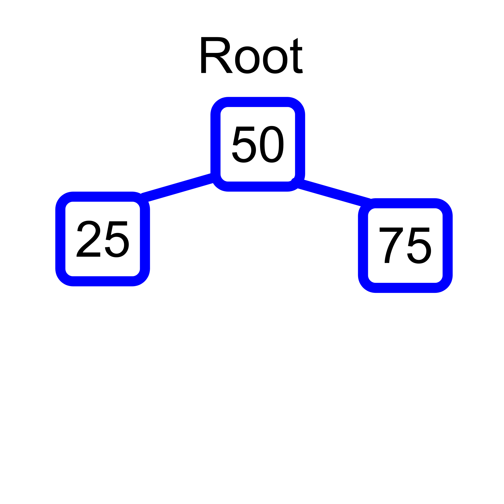
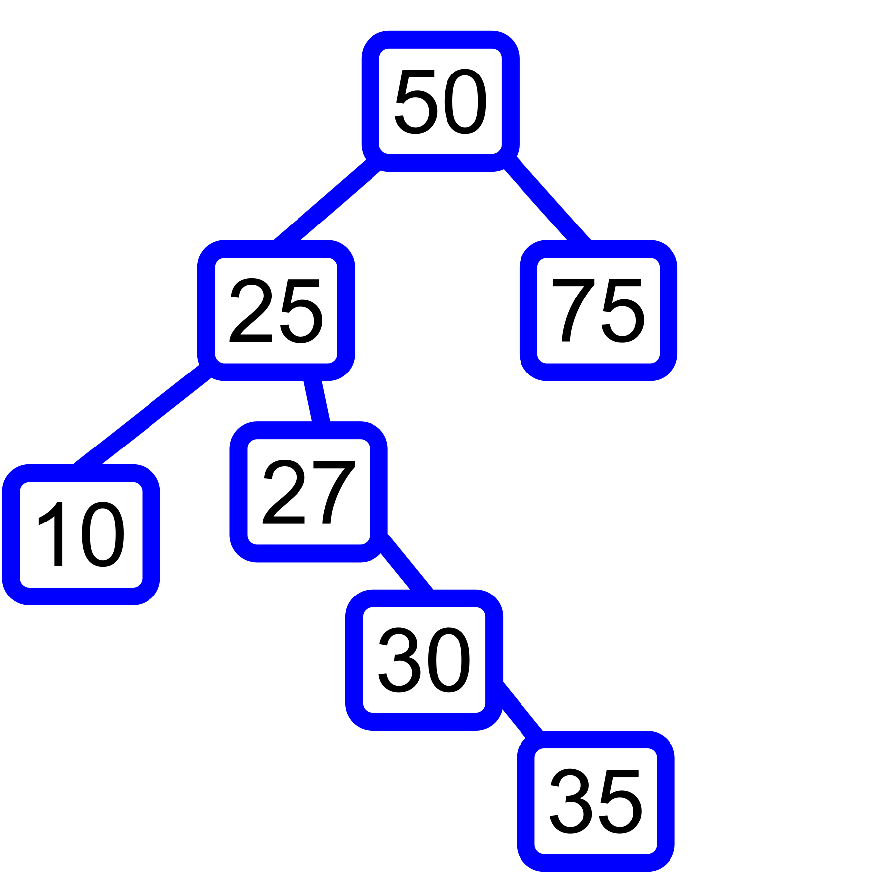
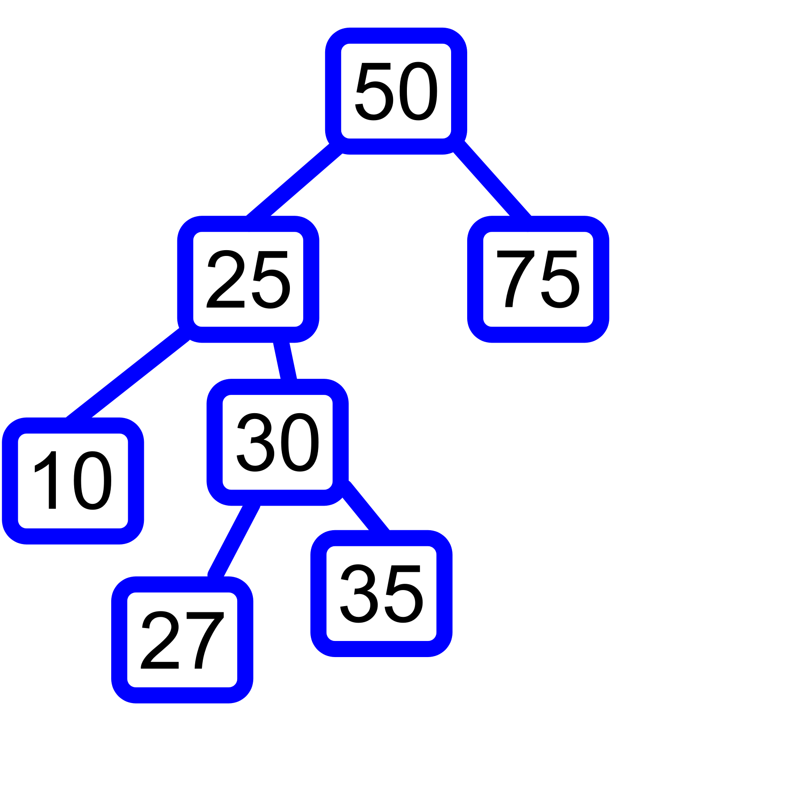

# Trees

The last data structure we will be learning in this tutorial is the binary tree. The three types of binary trees we will go over are the binary tree, the binary search tree, and the balanced binary tree. 

Let's start by defining a tree. A tree is a list that can connect to multiple different nodes. Like a linked list, a tree uses pointers to identify the neighboring nodes in the structure. In a binary tree, a node can have pointers to 2 `child` nodes. This node is known as the `parent`. The first node in this structure is the `root`, and any nodes that do not point to child nodes are known as `leaf` nodes. 

## Speed and the Binary Search Tree

Because a parent node can point to 2 children, when we isolate a parent node and it's children, the resulting structure is a `subtree`. This means that the nodes are not organized linearly, making it much faster to traverse a tree to find data.

This difference in speed is most apparent when we use a binary search tree. This is a binary tree in which values smaller than the preceding (or parent) node are placed on the left, and larger values are placed on the right. 




Let's start with a node that has a value of 50. If we want to append a node with a value of 75, we would append that value to the right side of the tree. If we want to connect another node with a value of 25 to our 50 node, it woulld go on the left side, as shown in the figure above. 

As we move through the tree, the same principle applies. This allows us to traverse our tree in O(log n) time, as we can effectively split the tree in half as we search for our value. If we are searching for the value of 15, we get rid of everything on the 75 side of the tree, as we know to search the side that is less than our starting value of 50. 


## Balanced vs. Unbalanced Binary Search Trees

In our example above, we were able to achieve a speed of O(log n) because the values in our tree were more or less evenly split. this means the subtree to the left of our root contains roughly the same number of nodes as the subtree to the right. Let's look at what an unbalanced tree would look like:



This linear connection of nodes hearkens back to the idea of a linked list. Because every node is in order, when we start at our root, we will not be able to eliminate any nodes in our search for a value. 

Another way a binary search tree becomes unbalanced is by adding to many nodes to one branch, making the `height` of the branch much heigher than all of the others. The height of a tree is the maximum number of nodes from the root to the leaves. In the example below, our tree becomes unabalnced by adding too many values to the 10 node:


## Balancing a Binary Tree

Because it can be extremely difficult to manually balance a tree structure, there are algorithims designed to balnce them for us. One such algorith is the Adelson-Velskii and Landis (AVL) algorithm. This algorithm will adjust the position of nodes in a tree so that the height is balanced between each subtree. This will make searching the tree as efficient and quick as possible. A more balanced example of a bianry search tree is shown below. While this is as balanced as we can get with our root being 50, if we were to move some of the nodes around even further, we can improve the trees balance even more.



## Balancing Challenge

Use the example tree given above to draw out a completely balanced binary search tree. Check your solution with the one provided when you are finished: [Solution](SolutionBalance.png)


## How to Traverse a Tree

Because a node can have more than one child, we need a special way to traverse all of the data inside. This process is called `Recursion`. This refers to the function that is executing calling iteself, often in order to look for data. This works well for a tree because we can traverse every branch, and unlike a loop, we do not end our search when the leaf of a node is reached. Rather, if we reach the leaf of a node (for this example, we will refer to the node with a value of `10` in our photo above), we simply finish executing the function call that is looking at that particular nodes data, and continue executing the parent function call that is looking at our `25` node. The next node our function call will search is the `15` node.


## Using a Binary Tree

To use a binary tree in Python, we need to run the command: `pip install bintrees` in our terminal. The following code takes in an unordered object, creates a balanced tree from it, and prints every value from the lowestto the highest. 

```python
# import bintrees
from bintrees import AVLTree

# Create an unordered object with key/value pairs
my_object = {'E':5, 'F':6, 'B':2, 'D':4, 'A':1, 'C':3}

# Create the tree using the object
my_tree = AVLTree(my_object)

# Prints each successive item after the lowest value in the tree
def print_tree(k, v):
    # Do not print beyond the last value
    if k is not my_tree.max_key():
        print(my_tree.succ_item(k))
my_tree.foreach(print_tree)
```
Output: 

('B', 2)

('C', 3)

('D', 4)

('E', 5)

('F', 6)

## Coding Challenge

Use bintrees to write a function that starts from the highest value in the tree and prints each previous item (output should start with ('F', 5) and end with ('B', 2)). Use the following object: `my_object = {'E':5, 'F':6, 'B':2, 'D':4, 'A':1, 'C':3}`. Hint: You can use [this](https://pypi.org/project/bintrees/) website to view bintrees syntax.

[Soultion](treesSolution.py)


